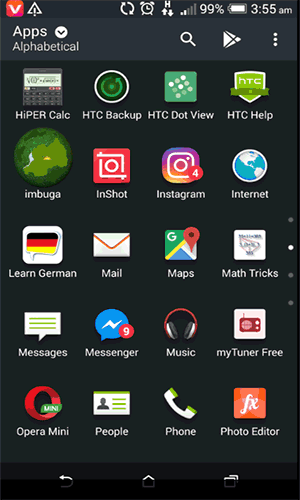

# imisozi-1000-UI-For-Browsin-On-Android-App
This is UI Browser codes which coded in format of xml from >> android studio >> Resource >> Layout >> activity_main.xml which provide good User Interface 

